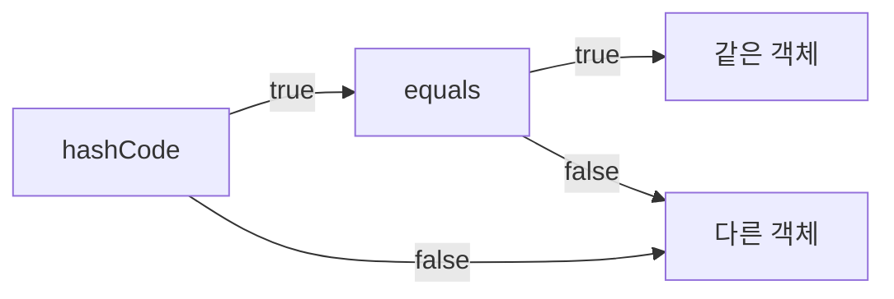

# Tech Interview - Java

> C와 Java의 차이점은?

C와 Java의 차이점은 크게 JVM, GC, OOP가 있습니다.

"JVM"
Java는 바이트코드로 변환되어 JVM이라는 가상 머신에서 실행되는 반면, C에서는 이진코드로 변환되어 하드웨어에서 직접 실행합니다.
때문에 자바는 하드웨어에 독립적이지만, C 언어는 하드웨어에 종속적입니다.

"GC"
Java는 자동으로 메모리를 관리해주는 GC를 갖고 있지만, C 언어에서는 개발자가 직접 메모리를 관리해야합니다.
개발자가 직접 메모리를 관리하게되면 메모리 누수나, 오버플로우 등 버그가 발생할 가능성이 있습니다.
자바에서도 GC로 인해 성능저하가 발생할 수 있기 때문에 개발자는 GC가 빈번하게 일어나지 않도록 주의해야합니다.

"OOP"
Java는 객체 지향 언어로 클래스, 다형성 등을 객체지향 개념을 지원하지만, C 언어는 객체 지향 개념이 없습니다.
객체 지향 프로그래밍은 대규모 프로젝트에서 가독성과 유지보수성이 좋기 때문에 Python이나 JS같은 대부분의 현대 언어들은 대부분 객체지향 프로그래밍을 지원하고 있습니다.

> 자바의 장점과 단점을 설명해주세요

자바의 장점으로는 플랫폼 독립성, 메모리 관리, 객체 지향 지원이 있습니다.
자바는 JVM 위에서 실행되기 떄문에 다양한 하드웨어에서 실행할 수 있습니다. 또한 GC를 통해 메모리를 관리하기 때문에 메모리 누수나 오버플로우 발생에 상대적으로 안전합니다. 또한 객체 지향 프로그래미을 지원하기 때문에 유지보수하기 용이한 코드를 작성할 수 있습니다. Java8 부터는 함수형 패러다임을 도입하면서 함수형 프로그래밍과 리액티브 프로그래밍도 지원하고 있습니다.

자바의 단점으로는 불필요한 메모리 사용, 문법의 복잡성, 높은 리소스 요구량이 있습니다.
자바는 GC를 통해 메모리가 관리되지만, 불필요한 메모리를 사용하는 경우 GC가 빈번하게 발생하여 성능이 저하될 수 있습니다. 또한 C 언어에 비해 문법이나 구문이 조금 더 복잡하기 때문에 클래스나 객체지향 개념에 익숙하지 않다면 초반 러닝커브가 있을 가능성이 있습니다. 또한 다른 언어에 비해 상대적으로 높은 리소스를 요구하기 때문에 임베디드와 같은 제한된 환경에서는 문제가 발생할 수 있습니다.

> OOP가 무엇인가요?

**객체 지향**이란 프로그램을 **객체들로 구성**하고, **객체들 간의 상호작용**을 통해 프로그램을 만드는 것을 말합니다.
객체 지향 프로그래밍은 프로그램을 **유연하고, 변경이 용이**하게 만들어줍니다.
유연하고 변경이 용이하다는 것은 새로운 기능을 추가하거나, 기존의 기능을 변경할 때,
**기존의 코드를 수정하지 않고**, 새로운 코드를 추가하거나 변경할 수 있다는 것을 의미합니다.

> SOLID가 무엇인가요?

로버트 마틴이 정리한 좋은 객체 지향 설계의 5가지 원칙을 의미합니다.
- SRP(Single Responsibility Principle) : 단일 책임 원칙
  - 하나의 클래스는 하나의 책임만 가져야 한다.
  - 책임이라는 것은 상황에 따라 다르지만, 중요한 기준은 변경에 대한 파급효과가 적어야한다는 것이다.
  - 즉, 어떤 변경이 있을 때 하나의 클래스만 수정하고, 다른 클래스는 수정하지 않아도 되도록 해야합니다.
- OCP(Open/Closed Principle) : 개방-폐쇄 원칙
  - 확장에는 열려있고, 수정에는 닫혀있어야 한다.
  - 즉, 기존의 코드를 변경하지 않고, 새로운 기능을 추가할 수 있도록 해야합니다.
  - 이를 위해 인터페이스와 추상 클래스를 활용해서 확장에 대한 유연성을 확보할 수 있습니다. 
- LSP(Liskov Substitution Principle) : 리스코프 치환 원칙
  - 자식 클래스는 언제나 부모 클래스를 대체할 수 있어야 한다.
  - 즉, 상속 관계에서 부모 클래스의 기능을 사용하는 코드가 자식 클래스에서도 정상적으로 동작해야합니다.
- ISP(Interface Segregation Principle) : 인터페이스 분리 원칙
  - 클라이언트는 자신이 사용하지 않는 메서드에 의존 관계를 맺으면 안된다.
  - 즉, 인터페이스를 클라이언트에 특화되도록 분리시켜야한다는 것입니다.
- DIP(Dependency Inversion Principle) : 의존 역전 원칙
  - 고수준 모듈은 저수준 모듈에 의존하지 않아야 한다. 
  - 구현 클래스가 아닌 인터페이스나 추상 클래스에 의존해야한다는 것입니다.

> 추상화에 대해 설명해주세요

추상화란 복잡한 시스템에서 중요한 정보만 노출하고, 불필요한 정보는 숨기는 것을 의미합니다. 외부 시스템이나 복잡한 라이브러리 기능들을 메소드 호출로 제공하거나 외부에서 의존관계를 주입해주는 방식으로 복잡성을 줄일 수 있습니다.

객체지향 프로그래밍에서는 이는 클래스와 인터페이스를 통해 구현합니다. 인터페이스를 통해 실제 구현 내용은 숨기고, 다양한 구현 클래스가 같은 인터페이스를 implement하면, 해당 인스턴스를 사용하는 클래스에서는 구현 내용은 신경쓰지 않아도 되기 때문에 변경이 용이해지고, 복잡도가 줄어듭니다.

> 객체지향 프로그래밍의 특징 (상속/추상화/다형성/캡슐화)에 대해 설명해달라

> 추상 클래스와 인터페이스의 차이

추상 클래스와 인터페이스는 둘다 인스턴스를 생성할 수 없고, 상속/구현한 클래스에 추상 메서드 구현을 강제합니다.

하지만 추상 클래스는 자식 클래스에서 추상 메서드를 통해 기능을 확장하는데 목적이 있지만, 인터페이스는 구현 클래스에서 추상 메서드를 구현하여 동일한 기능을 해야하는 경우에 사용합니다.

즉, 추상 클래스를 상속한 자식 클래스는 동작과 결과가 다를 수 있지만, 인터페이스를 구현한 클래스는 내부 구현은 달라도 동작과 결과가 같아야합니다.

> 인터페이스는 왜 사용하는가?

인터페이스를 사용하는 가장 큰 이유는 객체지향에서 다형성을 구현하기 위해서 입니다. 다형성은 하나의 참조변수로 여러 타입의 객체를 참조할 수 있는 것을 의미합니다.

인터페이스를 구현한 클래스들은 모두 해당 인터페이스 타입으로 참조될 수 있기 때문에, 인터페이스를 사용해서 의존성을 주입받으면 객체 간의 결합도가 줄어들어 변경이 용이하게 됩니다.

> OOP를 잘하기 위해 어떤 노력을 했는지?

> OOP에서 지향하는 바가 무엇일까요?

> JVM이란 무엇인가?

JVM이란 자바 바이트 코드가 실행되는 가상머신 입니다.

"이식성"  
JVM을 사용하면 플랫폼에 상관없이 자바 프로그램을 실행시킬 수 있기 떄문에 이식성이 좋습니다.

"GC"  
JVM에서는 GC를 사용해서 메모리를 관리해주기 떄문에 메모리 누수를 방지하고 개발자가 메모리 관리를 신경쓰지 않도록 도와줍니다.

"JIT"  
또한 JIT 컴파일러와 같은 기술을 통해 프로그램 런타임에 네이티브 코드를 사용하도록 최적화를 수행하여 성능을 향상시킬 수 있습니다.

> JVM 기반 언어의 특징을 설명해주세요.

Java, Kotlin, Groovy 같은 JVM 기반 언어들은 JVM의 이점을 활용하여 플랫폼 독립적으로 실행되고, GC를 사용하여 메모리를 관리하고, JIT 컴파일러를 사용하여 최적화를 수행한다는 특징이 있습니다.

> JVM의 구조에 대해 설명해주세요

JVM은 클래스 로더(Class Loader), 데이터 영역(Runtime Data Area), 실행 엔진(Execution Engine)으로 나눌 수 있습니다.

클래스 로더에서는 클래스 정보를 가져와서 초기화를 수행합니다. 

데이터 영역은 스택과 힙 등 런타임에 사용되는 메모리 영역이고, 

실행 엔진에서는 JIT, GC 등이 실행됩니다.

> Java Application이 JVM에서 실행되는 과정을 설명해주세요.

> JVM과 GC에 대해 설명해주세요.

> JVM의 메모리(Runtime Data Area)구조에 대해 설명해주세요.

> Java의 세 가지 변수에 대해 JVM 메모리와 연관지어 설명해주세요.

> 정적(static) 이란?

> Java의 static 변수에 대해 설명해주세요.

> Java의 main 메소드가 static인 이유에 대해 알고 계시나요? (public static void main(){String args[]})

> Java의 접근 제한자에 대해 설명해주세요.

> Java의 접근 제어자의 종류와 이에 대해 설명하세요

> final과 finally, finalize의 차이에 대해 알고 계신다면 설명 부탁드립니다.

> GC 가비지 컬렉션에 대해 아는 대로 설명하시오

> GC 동작원리에 대해 설명해주세요.

> GC 알고리즘 중 아는 것 있나요?

> GC가 언제 동작하는지 설명해주세요.

> 메모리 누수를 확인하거나 관련된 문제를 해결한 경험이 있나요?

> try-catch-finally의 단점과, 이로 인해 나온 구문에 대해 알고 계신다면 설명해주세요.

> Java에서의 데이터 타입은 무엇이 있나요?

> Java는 멀티 스레드(Multi Thread) 환경인데 멀티스레드란 무엇인가?

> 멀티 스레드(Multi Thread) 사용 이유는?

> Java에서의 MultiThread 프로그래밍에 대해 설명해주세요.

> Thread 관련한 코드 작성 경험이 있나요?

> 동기화가 무엇인지, Java에서 동기화 문제를 해결하는 방법에 대해 설명해주세요.

> Java의 Fork-Join Pool이 무엇인지 설명해주세요.

> Java의 Stream API에 대해 알고 계시나요? 안다면 아는대로 설명해주세요.

먼저 스트림이란 일련의 데이터가 처리되는 일회성 흐름입니다.
자바에서는 스트림 API를 사용하여 컬렉션이나 배열을 스트림이라는 단위로 처리할 수 있습니다.

스트림 API은 원본 데이터를 가지고 새로운 스트림을 생성하여 사용하기 떄문에 원본 데이터를 보존할 수 있고, 일회성이기 떄문에 재사용이 불가능합니다.

파이프라인과 병렬처리를 자동으로 처리하기 때문에 많은 연산을 처리할 때 유용하게 사용될 수 있습니다.

또한 내부 구현은 숨기고 선언적으로 사용할 수 있기 때문에 가독성 측면에서도 이점이 있습니다.

Stream API는 생성, 중간연산, 최종연산의 과정을 통해 처리가 이뤄집니다. 생성은 기존 컬렉션이나 배열에서 스트림을 생성하는 연산이고, 중간 연산은 스트림을 변환하는 연산, 최종 연산은 스트림을 소비하는 연산입니다.

생성과 중간 연산은 스트림을 생성하기 때문에 다른 중간 연산을 사용할 수 있지만, 최종연산은 스트림의 요소들을 소비하여 결과를 도출하기 때문에 최종연산 이후에는 스트림을 더 이상 사용할 수 없습니다.

> Java에서 Lambda가 무엇인가요?

람다식은 익명 클래스를 간결하게 표현할 수 있는 표현식입니다.
람다는 일급객체이기 때문에 변수에 할당하거나, 파라미터, 리턴값으로 사용될 수 있습니다. 람다 표현식을 사용하여 생성된 함수는 함수형 인터페이스를 통해 선언할 수 있습니다.

함수형 인터페이스란 단 하나의 추상 메소드만을 갖는 인터페이스 입니다. 주로 @FunctionalInterface 어노테이션을 사용하여 메서드를 1개만 갖도록 강제합니다.

> 일반적으로 병렬적으로 처리하는 메서드에서 발생하는 문제점들에 대해 아는 부분 설명해주세요.

> 병렬 프로그래밍에 대해 아나요? 프로그래밍을 해본 적이 있나요?

> 병렬 프로그래밍을 할 때 어떤 부분을 유의해야 하나요? 세마포어와 뮤텍스에 대해 알고 있나요? 생길 수 있는 문제는?

> 반복문을 사용했을 때랑 성능 차이를 직접 비교해봤나?

Stream API를 사용했을 떄 간단한 연산의 경우에는 반복문보다 느린 것으로 알고있습니다. 이는 Stream API를 사용할 때 스트림을 생성하거나, 중간연산 혹은 최종연산에서 불필요한 오버헤드가 발생하기 때문입니다.
* 불필요한 오버헤드에는 높은 추상화로 인해 메서드를 호출하는 비용이나, 중간 연산에서 필터링이나 매핑으로 인해 새로운 스트림을 반환하는 오버헤드, 병렬처리할 때 발생하는 데이터 분할 등이 있을 수 있습니다.

하지만 스트림을 생성하거나 중간연산과 최종연산에서 발생하는 오버헤드보다 연산하는데 수행되는 비용이 더 크다면 내부적으로 파이프라인과 병렬처리를 수행하는 Stream을 사용하는 것을 고려할 수 있습니다.

> String과 StringBuilder, StringBuffer의 차이에 대해 설명해주세요.

세 가지 클래스 모두 문자열을 다루는 클래스이지만, 문자열 간의 연산에서 차이점이 있습니다.

String 클래스의 인스턴스는 불변입니다. 문자열끼리 더할 때 '+' 연산자를 사용하게되는데, 만약 루프 안에서 반복적인 연산이 발생하는 경우 매 연산마다 새로운 String 객체가 생성되기 떄문에 메모리가 낭비되고, Full GC가 빈번하게 일어나서 성능이 저하될 수 있습니다.

반면 StringBuilder와 StringBuffer의 인스턴스는 변경 가능합니다. 따라서 문자열 간에 연산시 String 클래스를 사용하는 것보다 메모리 효율적이고 빠릅니다.

StringBuffer의 주된 차이점은 주요 메서드들이 synchronized를 사용하여 StringBuilder에 비해 thread-safe 하다는 것입니다.

> 동일성과 동등성의 차이를 설명해 보세요.

동일성이란 완전히 동일한 객체라는 것을 의미합니다. 2개의 참조변수가 둘 다 같은 객체를 가리키고 있으면, 두 변수는 동일하다고 할 수 있습니다. 동일성을 판별하기 위해서는 == 연산자를 사용합니다.

동등성이란 동일한 객체는 아니지만 객체의 내용이 같은 경우를 의미합니다. 2개의 변수가 서로 참조하는 객체는 다르지만 두 객체가 같은 내용을 가지고 있으면 동등하다고 할 수 있습니다. 동등성을 비교하기 위해서는 equals 메서드를 사용할 수 있습니다.

new String("")와 ""의 차이에 대해 메모리의 관점에서 설명해주세요.

> Java에서, ==와 equals의 차이는 무엇인지 알고 계시나요?

== 연산자는 동일성을 비교하기 위한 연산자이고, equals 메서드는 동등성을 비교하기 위한 연산자 입니다. 동일성이란 같은 객체임을 의미하고, 동등성이란 서로 다른 객체의 값 혹은 내용이 같다는 것을 의미합니다.

> String을 ==으로 비교하면 안되는 이유를 설명해주세요.

String을 비교하는 경우는 대부분 문자열이 같은지 비교하는 경우입니다. == 으로 비교한다면 해당 값이 아니라 객체의 주소값이나 해시값이 같은지 비교하기 때문에 같은 문자열인지 비교하는 경우에는 equals 메서드를 사용해서 동등성을 비교해야합니다.

> Overloading, Overriding을 각각 설명해주세요.

Overloading은 같은 이름의 메서드를 매개변수에 따라 여러개를 정의하는 것 입니다. 매개변수의 타입, 개수, 순서에 따라 같은 이름으로 여러개의 메서드를 정의할 수 있습니다.

Overriding은 자식 클래스에서 부모 클래스의 메서드를 새롭게 정의하는 것입니다. 오버라이딩하는 메서드는 부모 클래스의 메서드와 같은 이름, 같은 매개변수 리스트를 가져야하고, 반환 타입은 부모 클래스의 메서드의 반환 타입 혹은 그 하위 타입이어야 합니다. 또한 접근제어자도 부모 클래스의 메서드보다 덜 제한적이어야합니다.

> 자바의 컬렉션에 대해 설명해주세요.

> 컬렉션 프레임워크의 종류에 대해 각각 설명해달라 (List, Set, Map)

> List/Set/Map 차이가 무엇인가요?

> List와 Map의 차이점은?

> 배열 안 중복제거를 위한 방법이 뭐가 있을까요?

배열 안에서 중복을 제거할 수 있는 방법은 Set 자료구조를 이용하는 방법과 Stream API를 사용하는 방법이 있습니다.

Set은 중복된 요소를 저장하기 않기 떄문에 배열의 모든 요소를 HashSet에 저장하면 중복을 제거할 수 있습니다.

또한 Stream API에서는 스트림의 중복 요소를 제거하는 중간연산으로 distinct()를 제공하고 있습니다. distinct()를 사용하면 컬렉션을 사용하는 방법보다 간결하게 코드를 작성할 수 있습니다.

> HashMap의 동작원리를 설명해주실 수 있나요?

> HashMap과 ConcurrentHashMap의 차이가 무엇인가요?

> HashMap과 TreeMap의 차이점에 대해서 설명해주실 수 있나요?

> 클래스와 객체의 차이점은?

제가 이해한 바로는, 클래스는 객체를 기술한 설계도 혹은 설명서이고, 객체는 프로그램에서 상호작용하는 단위를 의미하는 추상적인 개념입니다.

예를 들어 스프링에서는 클래스 정보를 바탕으로 빈이라는 객체를 생성해서 애플리케이션을 실행시킵니다. 이때 빈 객체는 싱글톤으로 생성되어 하나의 객체가 계속 사용될 수도 있지만, 스코프에 따라 요청할 때마다 새로운 객체가 생성될 수도 있습니다. 여기서 실제로 생성된 객체를 인스턴스라고 부릅니다.

> Java의 Wrapper Class에 대해 설명해주세요.

Wrapper Class란 원시 타입의 데이터를 래퍼런스 타입으로 다루기 위해 사용되는 클래스 입니다. 래퍼런스 타입으로 원사 타입을 다루게 되면, 그 값에 대한 메서드를 사용하거나 null 값을 이용할 수 있습니다. 또한 제네릭을 사용하기 위해서는 반드시 Wrapper Class를 사용해야합니다.

하지만 Wrapper Class를 사용할 때는 값을 비교할 때 ==이 아니라 equals를 사용해야하고, 연산 시 unBoxing이 필요하기 때문에 의도하지 않은 성능 저하가 발생할 수 있습니다.

> Boxing과, UnBoxing에 대해 설명해주세요.

Boxing이란 Wrapper Class를 원시 타입 데이터로 변환하는 것을 의미합니다. UnBoxing는 반대로 원시 타입 데이터를 Wrapper Class로 변환하는 것을 의미합니다. 자바에서는 AutoBoxing을 지원하기 때문에 원시타입과 Wrapper Class 사아의 변환이 자동으로 처리됩니다.

Enum 사용해보셨나요? Enum이란 무엇인가요?

> Java의 hashcode()에 대해 설명해주세요.

hashcode 메서드는 메모리 주소를 기반으로 한 고유 정수값을 반환하는 메서드 입니다. 최상위 클래스인 Object 클래스에 구현되어있기 때문에 모든 클래스는 hashcode()를 호출할 수 있습니다.

hashcode()를 오버라이딩할 때는 동등성을 올바르게 처리하기위해서 를 같이 오버라이딩하는 것이 일반적입니다. 둘 중 하나만 오버라이딩한다면 HashSet과 같은 자료형에서 동등한 객체로 인식하지 못하여 예상과 다른 결과가 나타날 수 있습니다.

> equals를 오버로딩하여 사용해봤나요? hashCode란 무엇인가요?

equals()를 오버라이딩할 때는 반드시 hashCode를 같이 오버라이딩해야합니다. equals만 오버라이딩한다면, 중복을 허용하지 않는 Set과 같은 컬렉션에서 값이 같은 객체를 중복해서 저장할 수 있습니다.

컬렉션에서는 두 객체가 같은지 비교할 떄 hashCode() 리턴값을 먼저 확인하고 equals()의 리턴값을 확인합니다.

따라서 equals와 hashCode를 같이 재정의해야 컬렉션에서 올바르게 동등성을 처리할 수 있습니다.

> 자바 reflection에 대해 설명해주세요

> Annotation이란?

> Lombok이 생성하는 메서드가 어느 시점에서 생성되나요?

> 제네릭(Generics) 이란?

> Generic을 쓰는 이유는 무엇인가요?

> Java의 직렬화와 역직렬화에 대해 설명해주세요.

> Error와 Exception의 차이에 대해 설명해주세요.

> Checked Exception은 언제 사용하나요?

> Unchecked, Checked Exception 차이가 뭔가요?

> JUnit4 와 JUnit5의 차이를 설명해주세요.

> JUnit의 생명주기에 대해 아는지?

> parallelStream() 메서드 사용시 예상되는 문제점에 대해 말해주세요.
