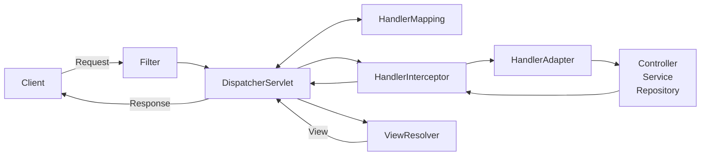

# Tech Interview - Spring

> 서블릿이 뭔가요?

**서블릿**이란 HTTP 클라이언트 요청과 응답에 대한 표준을 정의한 자바 클래스입니다.
서블릿은 HTTP 요청을 처리하고, 클라이언트에게 응답을 보내는 역할을 합니다.
이를 통해 웹 서버에서 동적인 페이지를 생성하고, 클라이언트에게 전달할 수 있습니다.
서블릿은 톰캣과 같은 서블릿 컨테이너에서 실행됩니다.

> 서블릿 컨테이너가 무엇인가요?

**서블릿 컨테이너**는 서블릿 인스턴스를 생성, 초기화, 소멸 등 생명주기를 관리하며, 
클라이언트 요청을 서블릿에게 전달하고, 서블릿의 응답을 클라이언트에게 전달하는 역할을 합니다.
이때 서블릿 인스턴스는 싱글톤으로 관리되며, 요청이 들어올 때마다 새로운 쓰레드를 생성하여 요청을 처리합니다.
대표적인 예시로 **톰캣**이 있습니다.

> 서블릿의 동작 방식에 대해 설명해주세요.

서블릿은 클라이언트에서 요청이 들어오면, 서블릿 컨테이너에 의해 서블릿 인스턴스가 생성됩니다.
이후 init() 메소드를 통해 초기화를 진행하고, service() 메소드를 통해 클라이언트의 요청을 처리합니다.
이때, service() 메소드는 HTTP 요청의 종류에 따라 doGet(), doPost(), doPut(), doDelete() 등으로 분기하여 처리합니다.
요청을 처리한 후, destroy() 메소드를 통해 서블릿 인스턴스를 소멸합니다.

* 서블릿 컨테이너에서 서블릿 인스턴스 생성
* 서블릿 인스턴스 초기화(`init()`)
* 클라이언트 요청 처리(`service()`)
  * HTTP 요청 종류에 따른 분기(`@WebServlet`) 
  * HTTP 요청에 따른 처리(`doGet()`, `doPost()`, `doPut()`, `doDelete()`)
* 서블릿 인스턴스 소멸(`destroy()`)

> 스프링이 뭔지 간단히 설명해보세요

**스프링 프레임워크**는 자바 엔터프라이즈 애플리케이션을 개발하기 위한 오픈 소스 프레임워크입니다.
스프링은 내부에서 컨테이너를 통해 자바 객체의 **생명주기를 관리**하며,
의존관계 주입(DI)을 통해 **객체지향 설계**를 할 수 있도록 도와줍니다.
또한, 스프링은 AOP(Aspect Oriented Programming)를 지원하여,
트랜잭션, 보안, 로깅 등의 **관심사를 분리**하여 모듈화할 수 있습니다.

> 스프링 프레임워크는 왜 쓰나? 스프링의 특징에 대해 아는대로 이야기 해봐라

스프링 프레임워크를 사용하는 가장 큰 이유는 좋은 객체 지향 애플리케이션을 개발할 수 있기 때문이라고 생각합니다.
스프링의 핵심 기술인 DI 컨테이너와, AOP를 통해 객체지향 설계를 할 수 있으며, 이를 통해 유지보수성이 높은 코드를 작성할 수 있습니다.

`DI 컨테이너`를 사용하면, 객체 간의 의존관계를 외부에서 주입받아 사용할 수 있습니다.
이를 통해 구현 클래스가 아니라 인터페이스에 의존하도록 하여, 코드의 유연성을 높일 수 있습니다.

`AOP`를 사용하면, 트랜잭션, 보안, 로깅 등의 공통된 관심사를 분리하여 모듈화할 수 있습니다.
이를 통해 핵심 비즈니스 로직과 관심사를 분리하여 코드의 가독성과 유지보수성을 높일 수 있습니다.

> 스프링 프레임워크는 요청을 어떻게 처리하는지 전반적인 흐름을 설명해봐라

스프링에서 클라이언트의 요청을 받으면,
먼저 Filter를 거쳐서 DispatcherServlet으로 요청이 전달됩니다.
DispatcherServlet은 HandlerMapping 을 통해 요청을 처리할 컨트롤러를 찾고,
HandlerInterceptor를 거쳐서 HandlerAdapter를 통해 컨트롤러를 실행합니다.
컨트롤러에서는 비즈니스 로직을 처리하고, 처리 결과를 Model에 저장합니다.
DispatcherServlet에 반환하기 전에 다시 HandlerInterceptor를 거치고,
DispatcherServlet은 ViewResolver를 통해 응답을 보낼 View를 찾습니다.
마지막으로 DispatcherServlet을 통해 View를 클라이언트에게 전달합니다.

> 스프링이랑 스프링 부트는 차이점이 뭔가요?

**스프링**이란 스프링 프레임워크 뿐만 아니라 스프링 프로젝트 전반을 의미하는 것으로 알고 있습니다.
그 중에 가장 핵심 기술을 제공하는 스프링 프레임워크를 보통 스프링이라고 줄여서 부르는데,
스프링 프레임워크를 사용하여 개발할 때 다양한 스프링 프로젝트와
외부 라이브러리를 사용할 일이 많아지면서 스프링 부트가 등장한 것으로 알고 있습니다.

**스프링 부트**는 스프링 프레임워크를 사용하여 개발할 때,
설정을 간소화하고, 빠르게 개발할 수 있도록 도와주는 도구라고 알고 있습니다.
스프링 부트는 내장형 톰캣을 사용하여 별도의 서버 설정 없이도 웹 애플리케이션을 실행할 수 있고,
스프링 프레임워크에서 설정해야 했던 많은 설정들을 자동으로 설정해주는 것으로 알고있습니다.

> 스프링 컨테이너란?

**스프링 컨테이너**는 **빈(Bean)의 생명주기를 관리**하고, **의존성을 주입**하는 역할을 합니다.
스프링 컨테이너는 빈 팩토리(BeanFactory)와 애플리케이션 컨텍스트(ApplicationContext)로 구분됩니다.

**빈 팩토리**는 빈을 생성하고, 의존성을 주입하는 기능을 기본적인 제공하며,
**애플리케이션 컨텍스트**는 빈 팩토리의 하위 인터페이스로서, 빈 팩토리가 지원하지 않는 메시지 소스, 국제화 등 추가적인 기능들을 제공합니다.
 - 메시지 소스 : messages.properties 파일을 읽어서 메시지 관리
 - 국제화 : Locale에 따라 다른 messages.properties를 읽어서 메시지 관리

> IoC/DI가 무엇인가요?

IoC(Inversion of Control)란 제어의 역전을 의미하며,
객체의 생성과 생명주기의 관리를 프레임워크가 담당하는 것을 의미합니다.
DI(Dependency Injection)는 IoC의 구현 방법 중 하나로,
객체 간의 의존관계를 외부에서 주입받아 사용하는 것을 의미합니다.

IoC/DI를 사용하면, 객체 간의 의존관계를 외부에서 주입받아 사용할 수 있으며,
이를 통해 객체 간의 결합도를 낮추고, 유연한 코드를 작성할 수 있습니다.
유연하고 변경이 용이하다는 것은 새로운 기능을 추가하거나, 기존의 기능을 변경할 때,
**기존의 코드를 수정하지 않고**, 새로운 코드를 추가하거나 변경할 수 있다는 것을 의미합니다.

> 의존성 주입이 무엇인지? 왜 쓰는지 설명해달라

**의존성 주입(DI)**이란 객체 간의 의존관계를 외부에서 주입받아 사용하는 것을 의미합니다.
의존성 주입을 사용하면, 객체 간의 결합도를 낮춰 객체 지향적으로 코드를 작성할 수 있습니다.
객체 지향적인 코드는 유연하고 변경이 용이하다는 것을 의미합니다.
또한 유연하고 변경이 용이하다는 것은 새로운 기능을 추가하거나, 기존의 기능을 변경할 때,
**기존의 코드를 수정하지 않고**, 새로운 코드를 추가하거나 변경할 수 있다는 것을 의미합니다.

의존성 주입 없이 다른 클래스의 인스턴스를 사용하기 위해서는 해당 클래스의 인스턴스를 직접 생성해야합니다.
만약 해당 클래스가 변경 또는 삭제되면, 해당 클래스를 사용하는 모든 클래스를 수정해야합니다.

하지만 의존성 주입을 사용하면, 해당 클래스를 사용하는 클래스는
해당 클래스의 인스턴스를 외부에서 주입받아 사용하기 때문에,
해당 클래스가 변경 또는 삭제되어도, 해당 클래스를 사용하는 클래스를 수정할 필요가 없습니다.

> Spring에서 DI를 구현하는 자바 기술은 뭔가요?

Spring에서 DI를 구현하기 위해서 `Annotation`, `XML`, `자바 Config 클래스`를 사용할 수 있습니다.

Annotation 기반 DI는 @Component와 @Autowired와 같은 어노테이션을 사용하여 의존성을 주입할 수 있습니다.
빈 인스턴스로 등록할 클래스에 @Component을 붙이고, 의존성을 주입받을 필드에 @Autowired를 붙이면,
스프링 컨테이너가 해당 클래스의 인스턴스를 생성하고, 의존성을 주입해줍니다.

XML 기반 DI는 XML 파일에 빈 설정을 작성하여 의존성을 주입할 수 있습니다.
XML 파일에 빈 설정을 작성하고, 빈 설정을 읽어서 빈 인스턴스를 생성하고, 의존성을 주입해줍니다.

자바 설정 클래스를 사용하면, 자바 클래스에 @Configuration을 붙여서 빈 설정을 작성할 수 있습니다.
빈 설정 클래스에 @Bean을 붙여서 빈 인스턴스를 생성하고, 의존성을 주입해줍니다.

> Spring DI/IOC는 무엇이고, 어떻게 동작하는가?

DI/IOC는 스프링에서 객체 간의 의존관계를 외부에서 주입받아 사용하는 것을 의미합니다.
스프링에서 DI/IOC를 사용하면, 객체 간의 결합도를 낮추고, 유연한 코드를 작성할 수 있습니다.

스프링에서 빈 팩토리(BeanFactory) 혹은 애플리케이션 컨텍스트(ApplicationContext)라는 컨테이너를 사용하여
객체의 생명주기를 관리하고, 의존성을 주입합니다.

컨테이너에서 빈 객체를 생성하고 의존성을 주입하는 과정은 다음과 같습니다.
1. 빈 설정을 읽어서 빈 객체를 생성합니다.
2. 빈 객체의 의존성을 주입합니다.
3. 초기화 콜백 메서드를 통해 빈 객체를 초기화합니다. 
4. 초기화가 완료된 빈 객체는 컨테이너에 의해 관리되며, 컨테이너가 소멸될 때까지 유지됩니다.
5. 컨테이너가 되기 직전에 소멸 콜백 메서드가 호출되어 빈 객체를 소멸합니다.  

> AOP(Aspect Oriented Programming)가 무엇인가요?

AOP(Aspect Oriented Programming)란 **관점 지향 프로그래밍**을 의미합니다.
AOP는 **관심사를 분리**하여 모듈화하는 프로그래밍 기법으로,
트랜잭션, 보안, 로깅 등의 공통된 관심사를 분리하여 모듈화하는 것을 의미합니다.

AOP는 핵심 비즈니스 로직과 공통된 관심사를 분리하여 코드의 가독성과 유지보수성을 높일 수 있으며,
핵심 비즈니스 로직에 영향을 주지 않고 공통된 관심사를 추가하거나 제거할 수 있습니다.

AOP 용어들을 설명해보세요.

MVC 패턴이란?

MVC1이랑 MVC2 패턴 차이에 대해 설명해주세요.

스프링 MVC 구조 흐름에 대해 과정대로 설명해보세요.

DispatcherServlet이 무엇인가요?

어떻게 하나의 컨트롤러로 여러 요청을 받을 수 있을까요?

Filter와 Interceptor의 차이가 무엇인가요?

Spring에서 제공하는 대표적인 Annotation 몇 가지만 예를 들어주세요.

Spring에서 서비스와 컴포넌트의 차이

Controller, RestController는 뭐가 다른가요? 응답이 어떻게 다른가요?

Spring Bean(빈)이란?

POJO란 무엇인가요?

스프링에서 빈(Bean)을 등록하는 방법에 대해 말해보세요.

스프링 빈의 라이프사이클은 어떻게 관리되는지 설명해주세요.

Spirng Bean의 Scope에 대해 설명하시오.

Spring의 싱글톤 패턴에 대해 설명해주세요.

Spring의 스코프 프로토 타입 빈에 대해 설명해주세요.

Spring MVC 에서 요청이 들어왔을 때부터 응답이 나갈 때까지의 흐름을 설명해주세요.

Spring Web MVC에서 요청이 들어와서 Database까지의 흐름

@RequestBody, @RequestParam, @ModelAttribute의 차이를 설명해주세요.

ControllerAdvice가 무엇인가요?

Field 주입과 생성자 주입, Setter 주입

WebFlux 써보셨나요?

